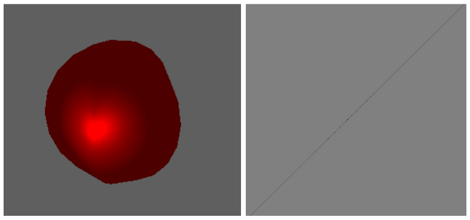
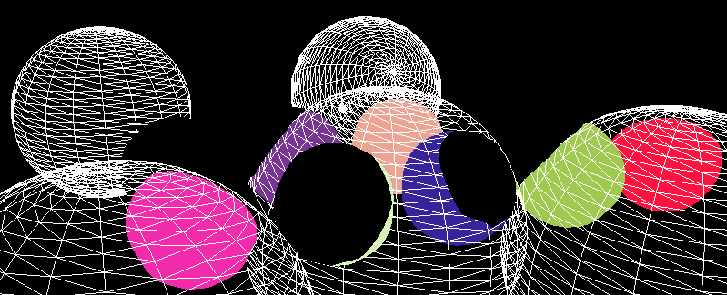

# Deferred Shading + View volume rendering in OpenGL

This project is an implementation of Deferred shading + view volume rendering in OpenGL & C++


|------------|---------|
|w, s        | Move forward/backward |
|a, d        | Move up/down |
| Arrow keys | Change what the camera is looking at |
| r          | Rotate camera |
| v          | See view volumes |
| c          | Light corners only |
| u          | See sphere colours, no lighting (debug view) |
| p,o, i     | In order: toggle ambient, diffuse & specular light |
| q          | Quit | 


## Introduction

An efficient rendering technique is paramount in modern game scenes with many lights interacting with the environment. One such technique is **deferred shading**.

## Forward Shading vs. Deferred Shading

Traditionally, scenes are lit using a 'forward shading' approach. It's a straightforward method where the lighting of an object is determined based on all lights present in the scene. For instance:

```c
sphere_t sphere_list[NUM_SPHERES];
light_t  light_list [NUM_LIGHTS];

for (sphere in sphere_list)
    sphere.render(light_list);  // Loop through each light and apply to the sphere
```
This method is suitable for scenes with fewer objects. However, in scenes with numerous objects, especially overlapping ones, it becomes inefficient.
Many objects might have their lighting calculated, only to end up being partially obscured.

Deferred shading, on the other hand, 'defers' the lighting calculation. Instead of calculating the lighting for all objects that reach the vertex shader, it only calculates lighting for objects in the final scene.
This is achieved through off-screen rendering, which provides the data needed to light our final scene. Consequently, lighting is only calculated for objects viewable from the camera.



## View Volume rendering
To further enhance efficiency, we introduce view volume rendering. When rendering graphics, the fragment shader is invoked multiple times. For instance, when drawing a shape, 
the fragment shader is called once for each pixel within the shape's area.

Consider a point light in our non-lit scene. Calculating the effect of this light on all pixels in our scene might seem redundant, especially given the limited radius of influence of such lights.
View volume rendering capitalizes on this by only calculating lighting for objects within a certain radius from the point light, thus minimizing calls to the fragment shader.

